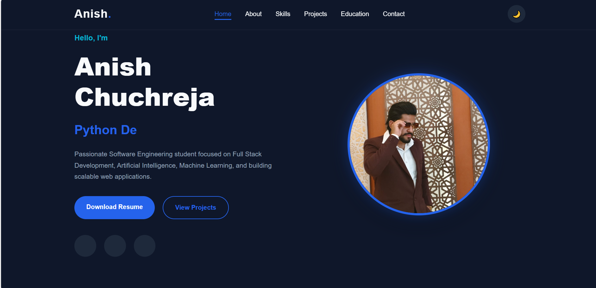
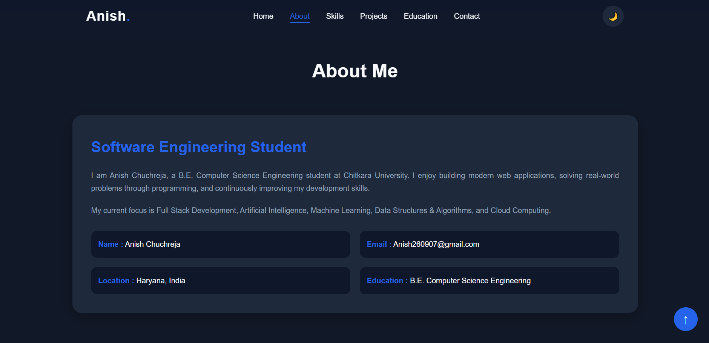
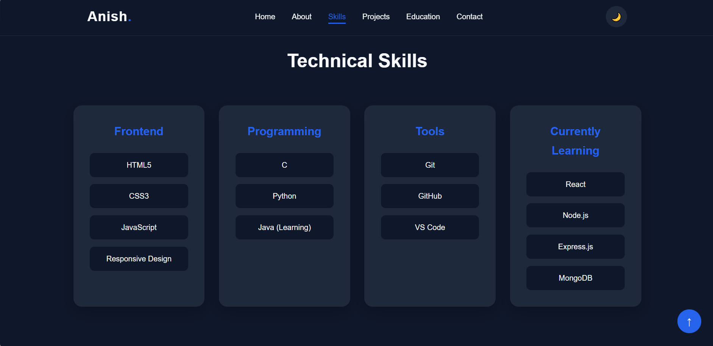
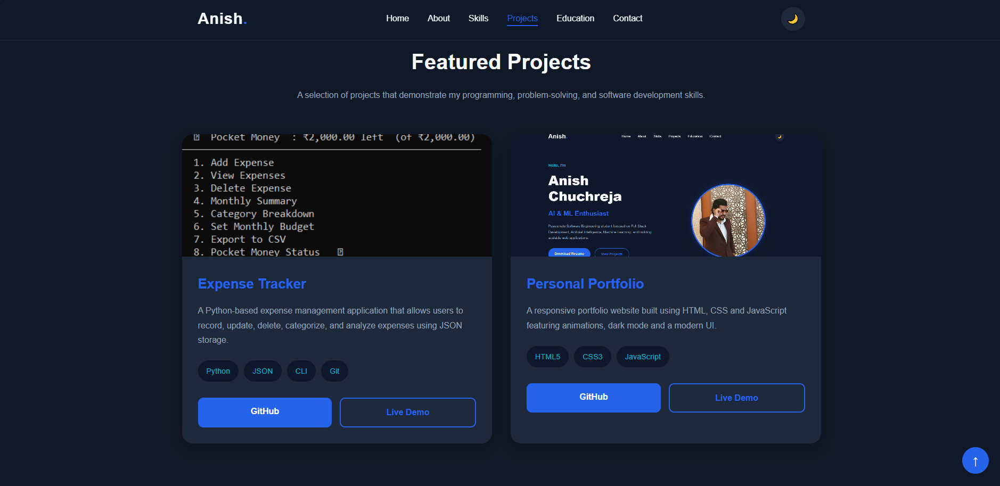
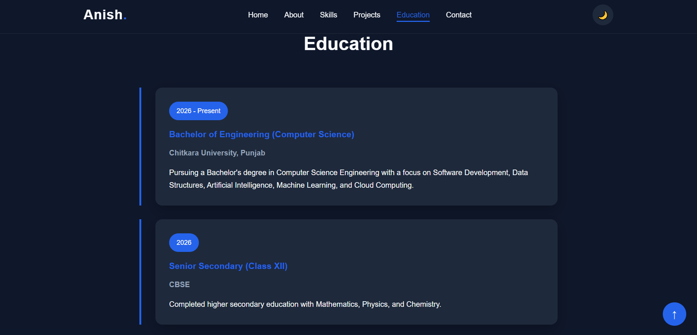
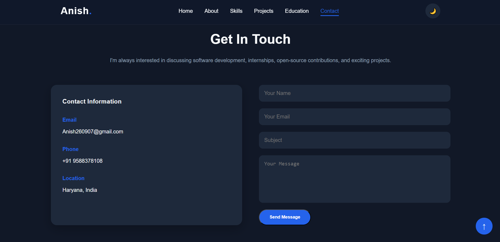
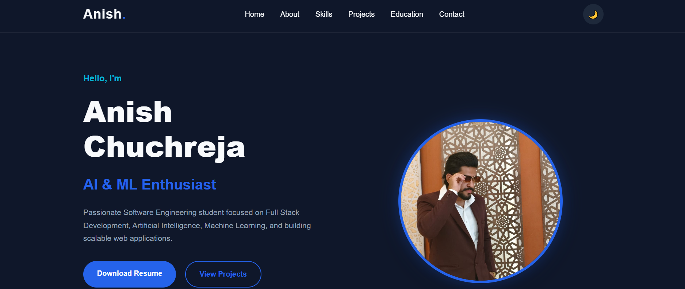

# 🚀 Personal Portfolio Website

A modern, responsive, and interactive personal portfolio website built using **HTML5, CSS3, and JavaScript**. This portfolio showcases my skills, projects, education, and professional profile while providing an elegant user experience across all devices.


## 📸 Preview

### Home


### About


### Skills


### Projects


### Education


### Contact



# ✨ Features

* 🎨 Modern and responsive UI
* 🌙 Dark / Light mode
* ⌨️ Typing animation
* 📜 Smooth scrolling
* 📊 Scroll progress indicator
* ✨ Scroll reveal animations
* 📱 Mobile-friendly navigation
* ⬆️ Back-to-top button
* 📂 Project showcase section
* 🎓 Education section
* 📜 Certifications section
* 💻 Coding profiles
* 📬 Contact section
* 📄 Downloadable resume

---

# 🛠️ Built With

* HTML5
* CSS3
* JavaScript (ES6)
* Google Fonts
* Font Awesome

---

# 📂 Project Structure

```
Professional-Portfolio/
│
├── index.html
├── style.css
├── script.js
│
├── assets/
│   ├── profile.jpg
│   ├── resume.pdf
│   └── favicon.png
│   ├── expense-tracker.png
│   ├── portfolio.png
└── README.md
```

---

# 🚀 Getting Started

### Clone the repository

```bash
git clone https://github.com/Anish-Chuchreja/portfolio.git
```

### Open the project

```bash
cd portfolio
```

### Run

Simply open `index.html` in your browser or use the **Live Server** extension in Visual Studio Code.

---

# 📌 Sections Included

* Home
* About
* Skills
* Projects
* Education
* Certifications
* Coding Profiles
* Contact
* Footer

---

# 💼 Featured Projects

* 💰 Expense Tracker
* 
  ### Expense-Trekker
  
  
* 🌐 Personal Portfolio

  ### Portfolio
  

More projects will be added as I continue my software engineering journey.

---

# 📚 Currently Learning

* React.js
* Node.js
* Express.js
* MongoDB
* Data Structures & Algorithms
* Artificial Intelligence & Machine Learning

---

# 👨‍💻 About Me

I am **Anish Chuchreja**, a Computer Science Engineering student passionate about software development, web technologies, artificial intelligence, and problem-solving. I enjoy building practical applications, learning modern technologies, and continuously improving my development skills.

---

# 📬 Contact

**Name:** Anish Chuchreja

**Email:** [Anish260907@gmail.com](mailto:Anish260907@gmail.com)

**LinkedIn:** https://www.linkedin.com/in/anish-chuchreja-73573a3a3

**GitHub:** https://github.com/Anish-Chuchreja

---

# 🤝 Contributing

Suggestions and feedback are always welcome. Feel free to fork this repository, open an issue, or submit a pull request.

---

# 📄 License

This project is licensed under the MIT License. You are free to use it for learning and personal portfolio development.

---

## ⭐ Support

If you found this project useful, consider giving it a **⭐ Star** on GitHub. It helps support my work and motivates me to continue building and sharing more projects.
